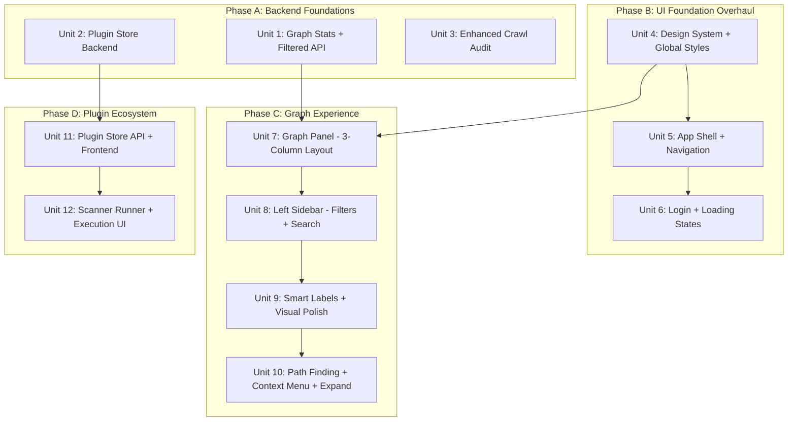

# Gossamer Phase 2: Production UI Overhaul, Plugin Store, Scanner Engine


## Context


Gossamer is a modular web attack-surface graph tool. Phase 1 built the pipeline (ingest, normalize, persist, query) and a functional-but-basic UI. Phase 2 transforms it into a **production-quality application** on par with BloodHound — polished dark UI, BloodHound-style query-driven graph exploration, spider/web visual identity ("gossamer" = spider silk), smooth animations, and a modular plugin ecosystem for external scanners.


**What already exists:** Finding + found_on types, Neo4j store with shortest_path + get_neighbors, `/api/graph/path` + `/api/nodes/{id}/neighbors` endpoints, 17 scanner ingestors, crawl audit, VulnsPanel, ScannersPanel (templates only).


**What this phase adds:** Complete UI overhaul with Gossamer identity, BloodHound-style graph exploration, plugin store for scanner binaries, generic scanner execution, enhanced crawl audit.


## Architecture Overview





---


## PHASE A: Backend Foundations (no frontend changes)


### Unit 1: Graph Stats + Filtered Snapshot API


**Files:** `backend/gossamer/graph_store/base.py`, `sqlite_store.py`, `neo4j_store.py`, `backend/gossamer/app.py`


**GraphStore ABC** — add two methods with default implementations:

```python

def get_graph_stats(self) -> dict[str, Any]:

    """Return {node_counts: {Host: N, ...}, edge_counts: {...}, total_nodes, total_edges}"""


def get_filtered_snapshot(self, include_kinds: list[str] | None = None,

                           exclude_kinds: list[str] | None = None,

                           limit: int = 5000) -> dict[str, Any]:

    """Like get_graph_snapshot but with server-side kind filtering."""

```


**SqliteGraphStore:**

- `get_graph_stats()`: `SELECT kind, COUNT(*) FROM nodes GROUP BY kind` + same for edges

- `get_filtered_snapshot()`: `WHERE kind IN (?)` or `WHERE kind NOT IN (?)`. For edges, subselect to only include edges where both src_id and dst_id are in the filtered node set


**Neo4jGraphStore:**

- `get_graph_stats()`: `MATCH (n) RETURN n.kind AS kind, count(*) AS c`

- `get_filtered_snapshot()`: `WHERE n.kind IN $kinds` in Cypher. Edge filter same approach.


**app.py — new/modified endpoints:**

- `GET /api/graph/stats` — returns node_counts, edge_counts, totals

- `GET /api/graph` — add optional query params: `kinds`, `exclude_kinds`, `limit`. Backward compatible (no params = full snapshot as before)


**Tests:** Add to `test_api_integration.py` — stats structure, filtered snapshot returns correct subset


---


### Unit 2: Plugin Store Backend


**Files:** `backend/gossamer/plugin_store.py` (NEW), `backend/gossamer/plugins/registry.json` (NEW), `backend/gossamer/config.py`, `backend/gossamer/app.py`


**`plugin_store.py`** — plugin manager:

- `PluginManifest` dataclass: id, type (scanner|ingestor|template_pack), name, description, version, source_repo (GitHub owner/repo), binary_name, install_method (github_release|pip|go_install), platforms dict, ingestor hint, default_args, updatable

- `list_plugins()` — reads bundled `registry.json`, merges installed state from `~/.gossamer/plugins/`

- `install_plugin(id)` — resolve platform, download from GitHub releases, extract to plugin dir

- `update_plugin(id)` — check latest GitHub release, download if newer

- `check_status(id)` — installed version, latest, binary path, binary found in PATH

- `uninstall_plugin(id)` — remove plugin dir

- `get_binary_path(id)` — check plugin dir, then PATH fallback


**registry.json** — bundled entries for: nuclei, semgrep, trivy, grype, gitleaks, trufflehog


**Config addition:** `plugin_dir: Path = Field(default=Path("~/.gossamer/plugins"))`


**API endpoints (app.py):**

- `GET /api/plugins` — list all with status

- `GET /api/plugins/{id}/status` — detailed status

- `POST /api/plugins/{id}/install` — install

- `POST /api/plugins/{id}/update` — update

- `DELETE /api/plugins/{id}` — uninstall


**Tests:** Unit tests for list/status/install with mocked filesystem and mocked HTTP


---


### Unit 3: Enhanced Crawl Audit


**Files:** `backend/gossamer/ingestors/crawl.py`


Extend `_emit_crawl_audit_findings()` with:


1. **Directory listing**: body matches `<title>Index of` / Apache/Nginx listing → severity=medium

2. **Cookie security**: `Set-Cookie` without `Secure`, `HttpOnly`, `SameSite` → severity=low

3. **CORS wildcard**: `Access-Control-Allow-Origin: *` → severity=medium

4. **Server info disclosure**: version in `Server` header (e.g. `Apache/2.4.51`) → severity=info

5. **Sensitive paths**: `/.git/`, `/.env`, `/wp-admin/`, `/.svn/`, `/backup`, `/debug`, `/phpinfo` → severity=high

6. **Open redirect**: 3xx with `Location` pointing to different domain → severity=medium


All use existing `emit_finding_on_target()` with `scanner="crawl_audit"`.


**Tests:** New cases in `test_crawl_mocked.py` for each check


---


## PHASE B: UI Foundation Overhaul


### Unit 4: Design System + Global Styles


**Files:** `frontend/src/styles.css`


Complete CSS overhaul to create the Gossamer visual identity — spider silk / web aesthetic, production polish:


**Color system refresh:**

```css

:root {

  /* Core darks - deeper, richer */

  --c-bg: #060810;

  --c-surface: #0d1117;

  --c-surface2: #151b27;

  --c-surface3: #1c2333;


  /* Gossamer accent - silk/thread colors (cool silver-blue) */

  --c-silk: #b8d4e8;

  --c-silk-dim: #7a9bb5;

  --c-silk-glow: rgba(184, 212, 232, 0.15);

  --c-thread: rgba(184, 212, 232, 0.08);  /* subtle web lines */


  /* Severity palette */

  --c-crit: #ff4757;

  --c-high: #ff6b6b;

  --c-med: #ffa502;

  --c-low: #7bed9f;

  --c-info: #70a1ff;

}

```


**Typography:** Add Inter font (system fallback chain). Tighten letter-spacing, refine font sizes for hierarchy.


**Micro-interactions & animations:**

```css

/* Silk thread shimmer for loading states */

@keyframes silk-shimmer {

  0% { background-position: -200% 0; }

  100% { background-position: 200% 0; }

}

.loading-silk {

  background: linear-gradient(90deg, transparent, var(--c-thread), transparent);

  background-size: 200% 100%;

  animation: silk-shimmer 1.5s ease-in-out infinite;

}


/* Web pulse for active/connected states */

@keyframes web-pulse {

  0%, 100% { box-shadow: 0 0 0 0 var(--c-silk-glow); }

  50% { box-shadow: 0 0 12px 4px var(--c-silk-glow); }

}


/* Smooth panel transitions */

.panel-enter { animation: panel-fade-in 200ms ease-out; }

@keyframes panel-fade-in {

  from { opacity: 0; transform: translateY(8px); }

  to { opacity: 1; transform: translateY(0); }

}

```


**Card refinement:** Subtle web-pattern background using CSS radial gradients (concentric circles at low opacity, evoking a spider web). Cards get a thin silk-colored top border.


**Button hierarchy:** Primary (silk-blue fill), secondary (outlined), ghost (transparent), danger. Smooth hover transitions with subtle glow.


**Table refinement:** Alternating row backgrounds, smooth hover, better spacing, monospace for IDs/paths.


**Scrollbar styling:** Thin, dark, matching the theme.


**Global utilities:** `.sev-critical`, `.sev-high`, `.sev-medium`, `.sev-low`, `.sev-info` with color-coded left border + background tint. `.badge` for count pills. `.status-dot` (green/yellow/red). `.truncate-cell`. `.empty-state` with web illustration.


---


### Unit 5: App Shell + Navigation


**Files:** `frontend/src/App.tsx`, `frontend/src/styles.css`


**Header redesign:**

- **Brand:** Gossamer logo (SVG spider-web motif, not generic radial lines). Larger, with subtle silk glow animation on hover.

- **Navigation:** Grouped tabs: "Explore" (Graph, Vulns), "Operations" (Ingest & Crawl, Scanners), "Configure" (Settings, Ingestors, Types, Queries, Data). Active tab has silk-blue underline with smooth slide animation.

- **Status bar:** Right side shows backend type (SQLite/Neo4j badge), node/edge count pill (fetched from `/api/graph/stats`), connection status dot.


**Tab layout:** Replace flat tab row with a cleaner grouped approach. Small group labels above tab sets (uppercase, 10px, muted).


**Toast notifications:** Redesign with severity colors, slide-in from bottom-right, auto-dismiss with progress bar.


**Main area:** Add subtle transition animation between tab switches (crossfade, 150ms).


---


### Unit 6: Login + Loading States


**Files:** `frontend/src/LoginGate.tsx`, `frontend/src/ErrorBoundary.tsx`, `frontend/src/styles.css`


**Login page redesign:**

- Full-screen dark background with subtle animated web pattern (CSS-only: radial gradient circles that slowly drift using `@keyframes`)

- Centered card with Gossamer logo and name, silk-blue top accent

- Input fields with smooth focus animation (border glow)

- "Continue" button with silk-shimmer loading state

- Error messages with red-tinted card slide-in


**Loading/boot screen:**

- Gossamer logo centered with web-pulse animation

- "Weaving connections..." text with silk-shimmer effect

- Graceful transition to main app (fade out loading, fade in shell)


**Error boundary:**

- Clean error card with "Thread broken" heading

- Stack trace in collapsible monospace block

- "Reload" button


---


## PHASE C: Graph Experience (BloodHound-style)


### Unit 7: Graph Panel - 3-Column Layout


**Files:** `frontend/src/panels/GraphPanel.tsx`, `frontend/src/styles.css`


**Layout restructure:**

```css

.graph-panel {

  display: grid;

  grid-template-columns: var(--sidebar-w, 260px) 1fr var(--inspector-w, 300px);

  grid-template-rows: auto 1fr;

  flex: 1;

}

.graph-toolbar { grid-column: 1 / -1; }

.graph-sidebar { grid-row: 2; overflow-y: auto; }

.graph-cy { grid-row: 2; }

.graph-inspector { grid-row: 2; overflow-y: auto; }

```


**Toolbar redesign:**

- Clean, compact toolbar with grouped controls

- Layout selector as icon buttons (not dropdown) — each layout gets a small icon

- Sliders in a collapsible "Display" dropdown to reduce toolbar clutter

- "Fit" and "Refresh" as icon buttons with tooltips

- Label mode dropdown (Smart/Full/Hidden/Kind)

- Status display (node/edge count, backend type) right-aligned


**Graph canvas styling:**

- Dark background matching `--c-bg`

- Cytoscape edge rendering: thin, semi-transparent silk-colored lines (not the current per-type colors which create visual noise)

- Node rendering: kind-specific colors with subtle outer glow

- Selection state: silk-blue ring around selected node

- Hover state: node size increase + full label tooltip


**Inspector panel redesign:**

- Section header: "INSPECTOR" uppercase with silk underline

- Node/edge details in clean property list

- Properties rendered as key-value pairs with copy button on hover

- Section for "Connections" showing edge count by type

- "Show in graph" button to center on selected node

- Empty state: web illustration with "Select a node" text


**Cytoscape config updates:**

- `wheelSensitivity` from UI prefs

- `minZoom: 0.1`, `maxZoom: 4`

- `boxSelectionEnabled: true`

- Edge style: `curve-style: 'unbundled-bezier'` for cleaner multi-edge rendering

- `min-zoomed-font-size: 12` for automatic label hiding at low zoom


---


### Unit 8: Left Sidebar - Filters + Search


**Files:** `frontend/src/panels/GraphPanel.tsx`, `frontend/src/styles.css`


**Query-driven initial view:** Graph starts showing only Host nodes (`GET /api/graph?kinds=Host`). Not all nodes at once. User expands from there.


**Sidebar sections (top to bottom):**


1. **Search** — Input with magnifying glass icon. Searches loaded Cytoscape elements by label, kind, properties (url, hostname, name). Results as scrollable list (max 50). Each result: color dot + kind badge + truncated label. Click → center + zoom + select. Debounced (200ms).


2. **Node Filters** — Fetch `/api/graph/stats` on mount. Checkbox per kind with:

   - Color swatch (from graph-type-registry)

   - Kind name

   - Count badge (right-aligned)

   - Default: Finding and Source unchecked

   - "All / None" toggle at top

   - Toggling re-fetches graph with `exclude_kinds` param


3. **Edge Filters** — Same pattern, collapsible. Less used so starts collapsed.


4. **Path Finder** — Section with:

   - Start node display (set via context menu or search)

   - End node display

   - "Find path" button (calls `POST /api/graph/path`)

   - "Clear path" button

   - Disabled with message when backend is SQLite


5. **Quick Actions:**

   - "Load hosts only" (reset to initial view)

   - "Load full graph"

   - "Clear graph"


**Sidebar animation:** Collapse/expand with smooth width transition (200ms). Toggle button (chevron icon) visible in collapsed state.


**Highlighting behavior during search:** Non-matching nodes get class `dimmed` (opacity 0.12). Matching nodes get `highlighted` class (silk-glow border). Clear search restores.


---


### Unit 9: Smart Labels + Visual Polish


**Files:** `frontend/src/panels/GraphPanel.tsx`, `frontend/src/styles.css`


**Smart label function** — `smartLabel(kind, props, mode)`:

- **Smart (default):**

  - Endpoint: strip scheme+host → `/path/page` (truncate at 30 chars)

  - Host: hostname as-is

  - Finding: `props.name` truncated to 25 chars

  - Form: `POST /path` (method + path only)

  - Source: `props.name`

- **Full:** `Kind: full_value`

- **Hidden:** empty string

- **Kind only:** just the kind name


**Edge labels:** Show edge kind on hover only (not permanent — reduces clutter).


**Node visual polish:**

- Larger nodes for Hosts (base size * 1.3), smaller for Sources (base * 0.7)

- Finding nodes get a subtle pulsing glow animation (CSS `@keyframes` via Cytoscape class)

- Selected node: silk-blue ring, slightly enlarged

- Hovered node: size increase + tooltip with full properties


**Graph animations:**

- Layout transitions: `animate: true` with `animationDuration: 300`

- New node additions (from "show neighbors"): fade-in animation

- Path highlight: edges in path get thicker + brighter, non-path elements dim


**Hover tooltip:** Positioned HTML div that follows mouse. Shows: kind, full label, key properties. Appears after 300ms hover delay, disappears on mouseout.


---


### Unit 10: Path Finding + Context Menu + Expand-on-Demand


**Files:** `frontend/src/panels/GraphPanel.tsx`, `frontend/src/styles.css`


**Context menu** — `cxttap` event on node shows a positioned dark panel:

- "Set as path start" (with spider-web start icon)

- "Set as path end"  

- "Show neighbors" → calls `GET /api/nodes/{id}/neighbors`, adds to graph

- "Hide this node"

- "Focus (show only this + neighbors)"

- Separator line

- "Copy ID"

- Menu dismisses on click-away or Escape


**Show neighbors implementation:**

- Fetch `/api/nodes/{id}/neighbors`

- For each returned node not already in Cytoscape, add it with fade-in

- Add corresponding edges

- Run incremental layout on new elements only (cose layout on the subgraph)

- Show count toast: "Added 12 neighbors"


**Path finding flow:**

1. User sets start (context menu or search result right-click → "Set as start")

2. User sets end

3. Sidebar shows start/end with node labels and "Find path" button

4. Click → `POST /api/graph/path` with `{from_id, to_id}`

5. On success: dim all elements, highlight path nodes/edges with silk-glow, zoom to fit path

6. "Clear path" restores previous view

7. On error (no path): toast "No path found between these nodes"


**Backend check:** On mount, fetch `/api/health`, read `backend` field. If `"sqlite"`, path finder section shows "Path queries require Neo4j" and button is disabled.


---


## PHASE D: Plugin Ecosystem


### Unit 11: Plugin Store API + Frontend


**Files:** `frontend/src/panels/ScannersPanel.tsx`, `frontend/src/styles.css`


**Plugin Store UI** (new section in ScannersPanel, above existing content):


**Layout:** Grid of plugin cards (2 columns on wide screens, 1 on narrow):

- Each card: plugin icon/emoji, name, description, version badge

- Status indicator: green dot (installed + found), yellow dot (installed, binary missing from PATH), gray dot (not installed), blue dot (update available)

- Action button: "Install" / "Update" / "Uninstall"

- Version comparison: installed vs latest in small text


**Card interactions:**

- Install button shows silk-shimmer progress while downloading

- Success/failure toast notifications

- "Check for updates" button at top re-fetches all plugin statuses

- Filter pills: "All" / "Scanners" / "Ingestors" / "Templates"


---


### Unit 12: Scanner Runner + Execution UI


**Files:** `backend/gossamer/scanner_runner.py` (NEW), `backend/gossamer/app.py`, `frontend/src/panels/ScannersPanel.tsx`


**Backend — `scanner_runner.py`:**

- `run_scanner(plugin_id, targets, options, progress_cb)` — look up plugin config, resolve binary, write targets to tempfile, build command, run via `subprocess.Popen`, capture stdout JSONL, stream progress, auto-ingest on completion

- `stop_scanner(scan_id)` — kill subprocess

- Safety: validate targets against `scope_hosts`


**API endpoints:**

- `POST /api/scanners/{plugin_id}/run` — SSE streaming (thread+queue, same as crawl/stream)

- `POST /api/scanners/{plugin_id}/stop` — kill running scan


**Frontend — "Run Scanner" card:**

- Plugin selector (only installed scanners)

- Target textarea (one URL/line)

- Options: severity filter checkboxes, template filter input, rate limit

- "Run" button → SSE stream with progress bar (reuse crawl progress component pattern)

- "Stop" button during execution

- Completion summary: findings count, duration, link to Vulns tab

- Scan history: last 5 runs with status badges


---


## Implementation Order


| Order | Unit | Phase | Dependencies | Estimated Scope |

|-------|------|-------|-------------|-----------------|

| 1 | Unit 1: Graph Stats + Filtered API | A | none | backend |

| 2 | Unit 3: Enhanced Crawl Audit | A | none | backend |

| 3 | Unit 2: Plugin Store Backend | A | none | backend |

| 4 | Unit 4: Design System + Global Styles | B | none | frontend CSS |

| 5 | Unit 5: App Shell + Navigation | B | Unit 4 | frontend |

| 6 | Unit 6: Login + Loading States | B | Unit 4 | frontend |

| 7 | Unit 7: Graph Panel - 3-Column Layout | C | Units 1, 4 | frontend |

| 8 | Unit 8: Left Sidebar - Filters + Search | C | Unit 7 | frontend |

| 9 | Unit 9: Smart Labels + Visual Polish | C | Unit 8 | frontend |

| 10 | Unit 10: Path Finding + Context Menu | C | Unit 9 | frontend |

| 11 | Unit 11: Plugin Store API + Frontend | D | Unit 2 | full-stack |

| 12 | Unit 12: Scanner Runner + Execution UI | D | Unit 11 | full-stack |


Phase A (units 1-3) can run in parallel. Phase B must be sequential (4→5→6). Phase C sequential (7→8→9→10). Phase D sequential (11→12). Phases B and A are independent; C depends on A1 and B4.


## Verification


### Backend

```bash

cd /home/user/gossamer/backend && pip install -e ".[dev]" && pytest -q

```


### Frontend

```bash

cd /home/user/gossamer/frontend && npm install && npm run build

```


### Integration Checklist

1. Login page: animated web background, smooth auth flow

2. App shell: grouped tabs, status bar with node count + backend badge

3. Graph: starts with Hosts only, sidebar shows stats

4. Filter: toggle Finding off → graph re-fetches without Findings

5. Search: type hostname → matching nodes highlighted, results in sidebar

6. Smart labels: Endpoints show `/path` not full URL

7. Context menu: right-click host → "Show neighbors" → endpoints appear with animation

8. Path finding (Neo4j): set start/end → path highlighted with glow

9. Plugin store: cards show available plugins, install button works

10. Scanner: run Nuclei → SSE progress → findings appear in Vulns tab

11. All panels render with new design system — consistent cards, typography, animations


