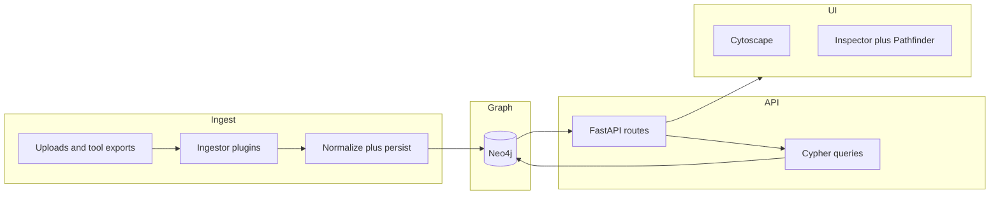

# Neo4j roadmap: graph store + BloodHound-style UX + findings

This document is the **repo-local copy** of the implementation roadmap for moving Gossamer’s graph from SQLite to **Neo4j**, adding **Cypher**-backed neighbors/path APIs, **BloodHound-inspired** UI patterns, and **modular findings** (Nuclei + manual + future scanners). It is descriptive only until the work is implemented.

## Why Neo4j

- **Path queries** — `shortestPath`, variable-length patterns, and relationship-type filters fit “exploit pather” exploration without custom BFS in Python.
- **Scale** — Large crawls (many `Endpoint` nodes and `links_to` edges) benefit from graph-native indexes.
- **Neighborhood queries** — Inbound/outbound structure in one round-trip vs multi-join SQL.

SQLite may remain for **auxiliary** concerns (uploads paths, `runtime.json`, legacy export) if useful; the **authoritative graph** moves to Neo4j.

## Target architecture

**Schema (implementation choice):**

- **Labels** — Prefer **per-kind** labels (`:Host`, `:Endpoint`, `:Source`, later `:Finding`) for filtering and UI styling; alternatively a single `:Entity` + `kind` property with one `id` constraint.
- **Relationship types** — Map today’s edge kinds (`serves`, `discovered_by`, `links_to`, later `FOUND_ON`) to consistent Neo4j relationship types.
- **Stable IDs** — Keep **hash-based `id` strings** from existing type definitions as the external API identifier; do not expose Neo4j internal element IDs in the HTTP contract.

## Implementation checklist

### Phase 0 — Foundation

- Add **Neo4j** to [docker-compose.yml](../docker-compose.yml) (Bolt + browser), volumes, auth env.
- Python **`neo4j`** driver; settings in config: `GOSSAMER_NEO4J_URI`, user, password, database name.
- New **`Neo4jGraphStore`**: upsert nodes/edges (MERGE), bounded snapshot, clear, neighbors, shortest-path helpers.
- **Constraints/indexes** on `id` (per label or global, per chosen schema).
- **Tests**: Testcontainers or `NEO4J_TEST_URI` in CI.

### Phase 1 — Migration

- **One-shot** SQLite → Neo4j import (preserve existing graphs).
- Optional **`GOSSAMER_GRAPH_BACKEND=neo4j|sqlite`** dual-write window for verification.
- Deprecate SQLite on the **hot path** after validation.

### Phase 2 — API (Cypher)

- `GET /api/graph` — capped subgraph; query params `host`, `kinds`; same JSON shape as today where possible.
- `GET /api/nodes/{id}/neighbors` — inbound/outbound, grouped by relationship type.
- `POST /api/graph/path` — shortest path with max hops and type allowlist; clean empty-path behavior.
- **Bundle export/import** — redefine for Neo4j (dump/APOC) or document breaking change; see [API.md](API.md) when implemented.

### Phase 3 — Frontend UX

- Declutter [GraphPanel](../frontend/src/panels/GraphPanel.tsx): label on hover/selected, filters, `fcose` / optional `dagre`, legend.
- **Inspector dock**: overview, inbound/outbound lists, neighbor navigation.
- **Pathfinder**: target selection + highlight path from API.

### Phase 4 — Findings (modular)

- **`:Finding`** nodes; **`FOUND_ON`** → `:Endpoint` (optional **`AFFECTS`** → `:Host`).
- **Nuclei** ingestor; **manual** create/update APIs; **Vulns** UI tab.
- Document scanner plugins in [EXTENDING.md](EXTENDING.md) (ingestor + mapping to Finding).

### Phase 5 — Attack-path semantics (light)

- Edge properties: `evidence`, `exploitability`, `confidence` where useful.
- Path responses flag paths touching **high-severity** findings.
- Optional persisted **saved paths** (Neo4j or sidecar JSON).

## Non-goals

- Full **BloodHound Enterprise** or **SharpHound AD** parity (different problem domain).
- Replacing **FastAPI** or **Cytoscape** by default (Bloom is optional later).

## Verification (when built)

- **Backend**: pytest — ingest, neighbors, paths, findings CRUD against Neo4j.
- **Frontend**: `npm run build`; manual smoke on large crawl + path + findings.

## Related docs

- [ARCHITECTURE.md](ARCHITECTURE.md) — update when Neo4j lands.
- [GRAPH_MODEL.md](GRAPH_MODEL.md) — logical model; Neo4j is storage mapping.
- [API.md](API.md) — new endpoints and env vars.
- [README.md](../README.md) — operator quick start with Neo4j.
